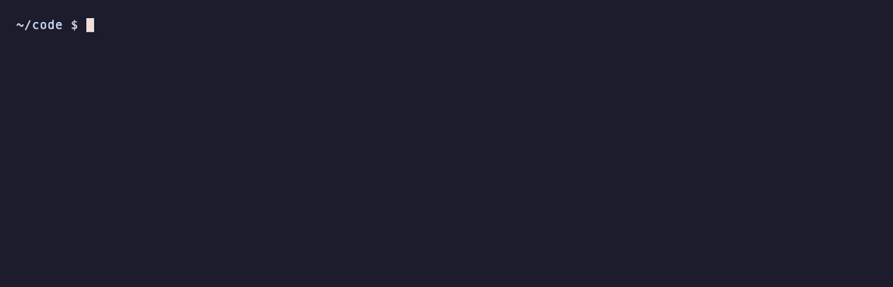
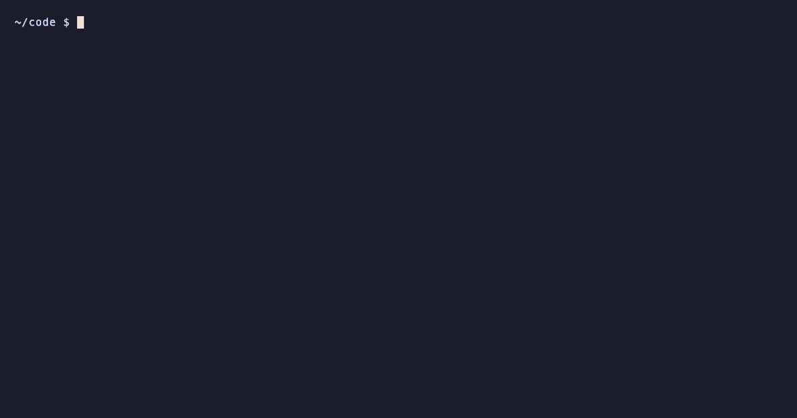

<div align="center">

# 🧹 rotscan

**Find & clear repo rot — one repo, or 100 at once.**

[](https://www.npmjs.com/package/rotscan)
[](LICENSE)
[](https://github.com/hamza-ali-shahjahan/hamzaish)

Broken links · committed secrets · dead files · dependencies that 404 on install — the rot that piles up in every repo and only bites at the worst time. `rotscan` finds it, shows you the *extent first*, and cleans it with confirmation.


</div>

---

Every repo quietly accumulates rot:
- 🔗 **Links** that 404 for everyone but you — moved files, gitignored targets, wrong-case paths that pass on macOS and break on Linux CI.
- 🔑 **Secrets** that slipped into a commit.
- 🗑 **Dead files** nothing references.
- 📦 **Dependencies** that don't resolve on npm (the `@inngest/sdk`-doesn't-exist class).

It's invisible day-to-day and surfaces at the worst moment: a reader's 404, a failing CI, a leaked key. **rotscan is the sweep that clears it on purpose.**

## Quickstart

Requires [Bun](https://bun.sh). Until rotscan lands on npm (imminent — then `bunx rotscan` from anywhere), run it straight from the repo:

```bash
git clone https://github.com/hamza-ali-shahjahan/rotscan && cd rotscan

bun rotscan.ts                 # scan the current repo → summary + next steps
bun rotscan.ts ~/code/my-app   # scan a specific repo
bun rotscan.ts --all ~/code    # scan EVERY git repo under a folder — 10 or 100, ranked by rot
bun rotscan.ts --fix .         # plan the cleanup (dry run); add --apply to write it
```

## How it works

rotscan reads only what **git tracks** — so it sees your repo the way a stranger, or your CI, does, not the way your laptop does (where a gitignored file or a wrong-case path quietly resolves). No config, any git repo. Three moves:

### 1. Sweep — see the whole pile at a glance

<p align="center"></p>

`rotscan --all <dir>` scans every git repo under a folder and ranks them by rot — ten repos or a hundred, one table. The **summary is the point**: a count per category, the messy repos on top, the clean ones marked `✓ tidy`. You see *where* the rot is before reading a single detail.

### 2. Drill — one repo, summary-first

<p align="center"></p>

`rotscan <repo>` opens one repo: the four counts first — 🔗 links · 🔑 secrets · 🗑 dead files · 📦 deps — then a few details per category (capped, never a wall). The lines that actually bite show up by name: a link that's the **wrong case** (passes on macOS, 404s on Linux CI), a **key that shipped in a commit**, a **dependency that doesn't exist on npm**.

### 3. Fix — on purpose, never by surprise

<p align="center"></p>

`rotscan --fix <repo>` prints a plan and writes **nothing**; add `--apply` to make the edits. It only ever de-links broken markdown links (keeping the text). Everything that needs judgement — rotate a leaked key, delete an unused asset, swap a dead package — is listed as **manual**, not auto-done. Safe by default.

## Built with Hamzaish

rotscan was born inside **[Hamzaish](https://github.com/hamza-ali-shahjahan/hamzaish)** — an AI-native startup factory — and spun out as a standalone tool. It started as a single guard that caught one broken link in CI, grew into a repo-wide scanner, and became the cleanup *stage* every Hamzaish build reaches for at a milestone. It's useful well beyond the factory, so here it is on its own.

If you like the "find the rot, show the extent, clean with confirmation" discipline, the factory it came from runs on the same idea: build fast, and let small guards keep it honest. → **[github.com/hamza-ali-shahjahan/hamzaish](https://github.com/hamza-ali-shahjahan/hamzaish)**

## Status

**v0.1 — early and honest.** The link, dead-file, and dep scanners are solid; the secrets scanner is high-confidence *pattern* matching (review-grade, not a replacement for `gitleaks`). Node-native distribution (so `npx` works without Bun) is on the roadmap. Issues and PRs welcome — be kind, be generous.

## License

[MIT](LICENSE) © 2026 Hamza Ali.
